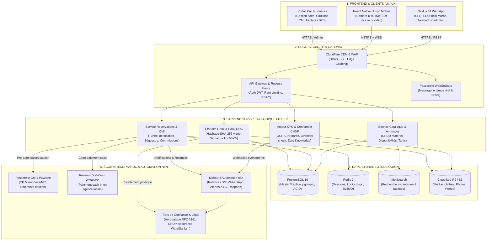
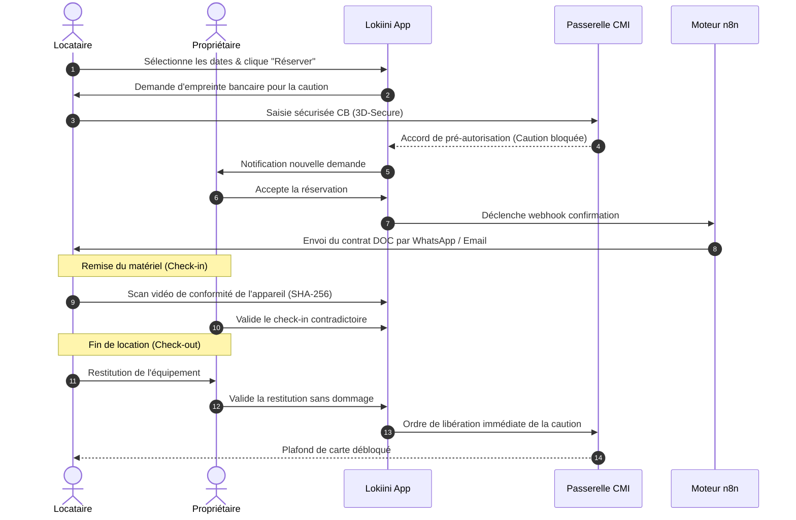

# 🏗️ Lokiini / MatOS — Architecture Système & Documentation Technique

> **Plateforme de location de matériel & d'équipements sécurisée au Maroc (Web + Mobile)**  
> *Paiement CMI & Cautions • KYC Biométrique CNDP • Contrat DOC Loi 53-05 • Moteur d'Automation n8n • 100% Dockerisé*

---

## 📌 Propriétés du Projet (Notion Database Properties)

| Propriété | Valeur |
|---|---|
| **Nom du Projet** | **Lokiini** *(ex-MatOS)* |
| **Statut** | 🟢 `En cours de développement (Phase MVP 100% Dockerisée)` |
| **Marché Cible** | 🇲🇦 Maroc (Casablanca, Rabat, Marrakech, Tanger, Fès, Agadir) |
| **Devise Principale** | MAD (Dirham Marocain) |
| **Charte Graphique** | Teal (`#0F6E56`) • Terracotta (`#D85A30`) • Sand (`#F7F4EE`) |
| **Conformité Réglementaire** | CNDP (Loi 09-08) • DOC (Art. 627+) • Signature (Loi 53-05) |
| **Passerelles Paiement** | CMI / Payzone (Cartes Bancaires) • CashPlus / Wafacash (Cash) |
| **Fichiers Excalidraw Modulaires** | 🏛️ `lokiini_system_architecture.excalidraw`<br/>💻 `lokiini_frontend_architecture.excalidraw`<br/>⚡ `lokiini_backend_architecture.excalidraw`<br/>🤖 `lokiini_n8n_architecture.excalidraw`<br/>🗄️ `lokiini_database_erd.excalidraw`<br/>🔄 `lokiini_uml_workflows.excalidraw`<br/>🎯 `lokiini_use_case_diagram.excalidraw`<br/>📦 `lokiini_class_diagram.excalidraw` |

---

## 🧭 Sommaire Interactif

- [1. Suite Complète des 8 Fichiers Excalidraw](#1-suite-complète-des-8-fichiers-excalidraw)
- [2. Vue d'Ensemble & Analyse Détaillée des 5 Paliers](#2-vue-densemble--analyse-détaillée-des-5-paliers)
  - [Palier 1 : Applications Frontend & Expérience Utilisateur](#palier-1--applications-frontend--expérience-utilisateur)
  - [Palier 2 : Edge Gateway, Sécurité Périphérique & Proxies](#palier-2--edge-gateway-sécurité-périphérique--proxies)
  - [Palier 3 : Microservices Métier, Moteurs IA & Confiance Légale](#palier-3--microservices-métier-moteurs-ia--confiance-légale)
  - [Palier 4 : Données, Cache, Indexation & Stockage Chiffré](#palier-4--données-cache-indexation--stockage-chiffré)
  - [Palier 5 : Écosystème Maroc, Monétique & Orchestration n8n](#palier-5--écosystème-maroc-monétique--orchestration-n8n)
- [3. Architecture n8n Détaillée : Le « Pourquoi » et le « Comment »](#3-architecture-n8n-détaillée--le--pourquoi--et-le--comment-)
- [4. Modèle de Données Relationnel & Schéma PostgreSQL 16](#4-modèle-de-données-relationnel--schéma-postgresql-16)
- [5. Spécifications UML Complètes (Use Cases, Classes & Séquence)](#5-spécifications-uml-complètes-use-cases-classes--séquence)
- [6. Tunnel de Location & Cycle de Vie de la Caution CMI](#6-tunnel-de-location--cycle-de-vie-de-la-caution-cmi)
- [7. Matrice de Sécurité & Conformité Marocaine](#7-matrice-de-sécurité--conformité-marocaine)
- [8. Déploiement 100% Dockerisé & Lancement en 1 Clic](#8-déploiement-100-dockerisé--lancement-en-1-clic)

---

## 1. Suite Complète des 8 Fichiers Excalidraw

La suite architecturale est scindée en **8 fichiers Excalidraw modulaires**, tous conçus en typographie manuscrite Virgil (`fontFamily: 1`), sans aucun débordement de texte :

1. 🏛️ **[lokiini_system_architecture.excalidraw](file:///d:/Lokiini/lokiini_system_architecture.excalidraw)** : Architecture Système Globale 5 Paliers avec pipelines d'interconnexion (189 éléments).
2. 💻 **[lokiini_frontend_architecture.excalidraw](file:///d:/Lokiini/lokiini_frontend_architecture.excalidraw)** : Architecture Frontend React 18, hiérarchie de composants & client API (95 éléments).
3. ⚡ **[lokiini_backend_architecture.excalidraw](file:///d:/Lokiini/lokiini_backend_architecture.excalidraw)** : Architecture Backend FastAPI asynchrone, modèles & pipeline de sécurité (91 éléments).
4. 🤖 **[lokiini_n8n_architecture.excalidraw](file:///d:/Lokiini/lokiini_n8n_architecture.excalidraw)** : 5 workflows d'automatisation n8n (195 éléments).
5. 🗄️ **[lokiini_database_erd.excalidraw](file:///d:/Lokiini/lokiini_database_erd.excalidraw)** : Schéma relationnel PostgreSQL 16 avec pgcrypto (93 éléments).
6. 🔄 **[lokiini_uml_workflows.excalidraw](file:///d:/Lokiini/lokiini_uml_workflows.excalidraw)** : Machine à états & Séquence CMI en 14 étapes (94 éléments).
7. 🎯 **[lokiini_use_case_diagram.excalidraw](file:///d:/Lokiini/lokiini_use_case_diagram.excalidraw)** : Diagramme de Cas d'Utilisation UML (101 éléments).
8. 📦 **[lokiini_class_diagram.excalidraw](file:///d:/Lokiini/lokiini_class_diagram.excalidraw)** : Diagramme de Classes UML (143 éléments).

---

## 2. Vue d'Ensemble & Analyse Détaillée des 5 Paliers



---

## 3. Architecture n8n Détaillée : Le « Pourquoi » et le « Comment »

Consultez le schéma dédié [**`lokiini_n8n_architecture.excalidraw`**](file:///d:/Lokiini/lokiini_n8n_architecture.excalidraw) pour visualiser les 5 workflows d'automatisation.

---

## 4. Modèle de Données Relationnel & Schéma PostgreSQL 16

Consultez le schéma dédié [**`lokiini_database_erd.excalidraw`**](file:///d:/Lokiini/lokiini_database_erd.excalidraw) pour le schéma graphique avec relations 1:N et types.

```sql
-- DDL PostgreSQL 16 avec pgcrypto
CREATE EXTENSION IF NOT EXISTS pgcrypto;

CREATE TABLE users (
    id UUID PRIMARY KEY DEFAULT gen_random_uuid(),
    full_name VARCHAR(120) NOT NULL,
    email VARCHAR(255) UNIQUE NOT NULL,
    phone_number VARCHAR(20) UNIQUE NOT NULL,
    hashed_password VARCHAR(255) NOT NULL,
    cin_number VARCHAR(100), -- Chiffré via pgcrypto
    is_kyc_verified BOOLEAN DEFAULT FALSE,
    kyc_liveness_score NUMERIC(5,2) DEFAULT 0.00,
    user_role VARCHAR(20) DEFAULT 'renter',
    company_name VARCHAR(150),
    company_ice VARCHAR(20),
    city VARCHAR(50) DEFAULT 'Casablanca',
    created_at TIMESTAMP WITH TIME ZONE DEFAULT NOW()
);
```

---

## 5. Spécifications UML Complètes (Use Cases, Classes & Séquence)

1. 🎯 **Diagramme de Cas d'Utilisation** : [**`lokiini_use_case_diagram.excalidraw`**](file:///d:/Lokiini/lokiini_use_case_diagram.excalidraw)
2. 📦 **Diagramme de Classes** : [**`lokiini_class_diagram.excalidraw`**](file:///d:/Lokiini/lokiini_class_diagram.excalidraw)
3. 🔄 **Machine à États & Séquence** : [**`lokiini_uml_workflows.excalidraw`**](file:///d:/Lokiini/lokiini_uml_workflows.excalidraw)

---

## 6. Tunnel de Location & Cycle de Vie de la Caution CMI



---

## 7. Matrice de Sécurité & Conformité Marocaine

| Domaine | Référence Légale / Norme | Mesure Technique Lokiini |
|---|---|---|
| **Protection des Données** | **Loi n° 09-08 (CNDP)** | Déclaration CNDP préalable, chiffrement pgcrypto, politique Zero-Knowledge (purge vidéo RAM) |
| **Validité des Contrats** | **Dahir des Obligations et Contrats (DOC)** | Contrat de louage de choses (Art. 627+) généré et signé pour chaque transaction |
| **Signature Électronique** | **Loi n° 53-05** | Horodatage RFC 3161, empreinte SHA-256 certifiée sur les états des lieux vidéo |
| **Monétique & Fraude** | **Normes CMI / PCI-DSS** | Aucune conservation des numéros de carte en base, protocole 3D-Secure v2 obligatoire |
| **Anti-Deepfake KYC** | **ISO/IEC 30107-3** | Algorithmes d'analyse de micro-textures et détection de reflets cornéens en direct |

---

## 8. Déploiement 100% Dockerisé & Lancement en 1 Clic

### Démarrage Automatique (Windows)
Double-cliquez sur [**`start_lokiini.bat`**](file:///d:/Lokiini/start_lokiini.bat) ou lancez :
```bash
docker compose up --build -d
```

### URLs Locales :
- **Web App** : [http://localhost](http://localhost) (ou [http://localhost:3000](http://localhost:3000))
- **API Swagger** : [http://localhost/docs](http://localhost/docs) (ou [http://localhost:8000/docs](http://localhost:8000/docs))
- **Automation n8n** : [http://localhost/n8n/](http://localhost/n8n/) (ou [http://localhost:5678](http://localhost:5678))
- **Moteur Meilisearch** : [http://localhost:7700](http://localhost:7700)
