# 🌟 Lokiini (لوكييني) — Contexte & Concept du Projet

> **Plateforme marocaine universelle de location de tout type de matériel et d’équipements entre particuliers et professionnels.**
> *Achetez moins, rentabilisez plus — Le tiers de confiance 100% digital, légal et sécurisé au Maroc.*

---

## 1. 📌 Résumé Exécutif (Executive Summary)

**Lokiini** (dérivé du terme dialectal marocain *« Loue-moi »*) est la première place de marché en ligne marocaine permettant de **louer et de mettre en location n'importe quel type de matériel, outillage, équipement ou véhicule**.

Face au coût élevé d'acquisition des équipements, à leur faible taux d'utilisation annuel et à l'informalité des pratiques traditionnelles (chèques de garantie risqués ou illégaux, absence de contrats formels, litiges sur les dégradations), **Lokiini apporte une infrastructure de confiance complète** :
- **Caution bancaire séquestrée sans débit immédiat** via le Centre Monétique Interbancaire (CMI).
- **Contrats de bail numériques juridiquement conformes** au Dahir des Obligations et Contrats (DOC, Art. 627+) et à la Loi n° 53-05.
- **Vérification d’identité certifiée CNDP** (Loi n° 09-08).
- **États des lieux vidéo contradictoires scellés par empreinte cryptographique SHA-256** et horodatage RFC 3161.

---

## 2. 🎯 Le Problème et l'Opportunité au Maroc

### Les Freins du Marché Traditionnel :
1. **Sous-utilisation des actifs** : Des milliers de matériels de valeur (caméras, tentes de réception, outillages pro, groupes électrogènes, véhicules utilitaires) dorment dans les garages et dépôts des particuliers et entreprises marocaines.
2. **Coût prohibitif de l'achat** : Pour un projet ponctuel (un mariage, un tournage vidéo, un chantier de rénovation, un déménagement), acheter l'équipement est économiquement irrationnel.
3. **Insécurité & Risque d'impayé / vol** : La location entre tiers repose souvent sur la confiance verbale ou la demande illégale de chèques de garantie (interdits par la loi marocaine pour cet usage).
4. **Litiges sur l'état du matériel** : Aucune preuve objective n'existe pour attester si une rayure ou panne préexistait avant la prise en main.

### La Réponse Lokiini :
Lokiini digitalise et sécurise l'intégralité du cycle de location : de la géolocalisation de l'article le plus proche jusqu'à la restitution, le déblocage de la caution et l'émission de la facture fiscale.

---

## 3. 🌐 Périmètre Universel des Catégories

Contrairement aux plateformes restreintes à un seul domaine (ex: BTP uniquement), Lokiini couvre **l'ensemble des équipements et biens louables** à travers 8 grands univers :

```
                               ┌──────────────────────────────────────────────┐
                               │             LOKIINI MARKETPLACE              │
                               │        Location Universelle au Maroc         │
                               └──────────────────────┬───────────────────────┘
                                                      │
         ┌───────────────────┬───────────────────┬────┴──────────────┬───────────────────┬───────────────────┐
         │                   │                   │                   │                   │                   │
   🎪 Événementiel     🎥 Audiovisuel      🔧 Bricolage        🚚 Véhicules        💻 High-Tech        🏥 Médical & Soins
     & Fêtes             & Drones            & Outillage         & Loisirs           & Gaming
   • Tentes caïdales   • Caméras 4K FX3    • Kärcher HP        • Fourgons 12m³     • Casques VR Quest  • Fauteuils alu
   • Sonorisation JBL  • Drones Mavic 3    • Perforateurs      • Quads 700cc       • PC Gamer RTX      • Lits médicalisés
   • Photobooths 360°  • Ronin Gimbal      • Tondeuses         • Remorques         • Écrans LED        • Oxygène
```

1. **🎪 Événementiel & Fêtes** : Tentes caïdales artisanales (50m² à 200m²), packs de sonorisation pro (JBL, Yamaha), éclairages festifs, tables/chaises de banquet, bornes photobooth 360°.
2. **🎥 Audiovisuel, Photo & Drones** : Caméras cinéma (Sony FX3, FX6, RED), objectifs broadcast, stabilisateurs DJI Ronin RS3, drones ProRes homologués, micros HF sans fil.
3. **🔧 Bricolage, Maison & Jardin** : Nettoyeurs haute pression thermiques (Kärcher), perforateurs démolition, ponceuses à parquet, tronçonneuses, échafaudages domestiques.
4. **🚚 Véhicules, Transport & Loisirs** : Fourgons utilitaires avec hayon (Renault Master 12m³ permis B), quads pour randonnées, remorques porte-engins, vélos électriques.
5. **💻 High-Tech, Informatique & Gaming** : Casques de réalité mixte Meta Quest 3, PC portables gamer puissants (RTX 4080 / i9), imprimantes 3D, rétroprojecteurs 4K.
6. **🏥 Santé & Matériel Médical** : Fauteuils roulants légers pliables, lits médicalisés électriques 3 fonctions, concentrateurs d’oxygène pour convalescence à domicile.
7. **🏗️ BTP, Chantier & Gros Œuvre** : Mini-pelles Bobcat, bétonnières 160L/350L, compacteurs à plaque vibrante, tours d'étaiement.
8. **⚡ Énergie & Électricité** : Groupes électrogènes insonorisés (5kVA à 50kVA), stations d'énergie solaires nomades pour tournages extérieurs ou camping.

---

## 4. 🛡️ Les 4 Piliers Fondateurs de Confiance

```mermaid
flowchart TD
    subgraph P1["Pillier 1 : Caution Séquestrée CMI"]
        A["Réservation du locataire"] --> B["Empreinte Bancaire CMI (sans débit)"]
        B --> C["Fonds bloqués sous séquestre"]
        C --> D["Libération automatique au retour conforme"]
    end

    subgraph P2["Pillier 2 : Cadre Juridique D.O.C"]
        E["Génération Automatique du Bail"] --> F["Articles 627+ du DOC Marocain"]
        F --> G["Signature Électronique Loi 53-05"]
    end

    subgraph P3["Pillier 3 : Identité & KYC CNDP"]
        H["Scan CIN / Passeport"] --> I["Test de Vivacité Biométrique (Liveness)"]
        I --> J["Purge RAM immédiate (Loi 09-08 CNDP)"]
    end

    subgraph P4["Pillier 4 : État des Lieux Vidéo SHA-256"]
        K["Vidéo 30s Prise en Main (Entrée)"] --> L["Empreinte SHA-256 + Horodatage RFC 3161"]
        L --> M["Contre-visite Vidéo (Sortie) & Comparaison"]
    end
```



### 1. Séquestre Bancaire CMI Sans Débit
- La caution n'est **pas encaissée** sur le compte bancaire du locataire, évitant d'assécher sa trésorerie.
- Le CMI réalise une **pré-autorisation monétique temporaire**.
- Dès validation du check-out de retour conforme, l'autorisation est levée instantanément.

### 2. Contrat de Louage D.O.C & Loi 53-05
- Chaque réservation édite automatiquement un contrat de louage officiel en langue française et arabe.
- Référence légale directe aux articles 627 et suivants du **Dahir formant Code des Obligations et des Contrats (DOC)**.
- Signature électronique juridiquement opposable devant les juridictions et tribunaux de commerce du Royaume.

### 3. Protection des Données CNDP (Loi n° 09-08)
- Architecture à divulgation nulle de connaissance (*Zero-Knowledge*).
- Les pièces d'identité (CIN/ICE) sont chiffrées en base (AES-256).
- Les flux vidéo du test de vivacité faciale sont analysés en mémoire volatile et purgés immédiatement.

### 4. État des Lieux Scellé SHA-256
- Capture vidéo rapide (30 secondes) de l'état fonctionnel et cosmétique lors de la remise en main propre.
- Génération d'une empreinte cryptographique SHA-256 stockée sur le contrat.
- Clôture de tout risque de litige abusif à la restitution.

---

## 5. 💰 Modèle Économique & Grille Tarifaire

Lokiini applique un modèle hybride : **Commission à la transaction + Abonnements mensuels pour les loueurs réguliers**.

| Formule | Prix Mensuel | Prix Annuel (-20%) | Commission | Capacité Annonces | Avantages Clés |
| :--- | :---: | :---: | :---: | :---: | :--- |
| **Gratuit** | **0 DH** | **0 DH** | **15%** | 3 annonces | • Particuliers occasionnels<br>• Caution CMI sans débit<br>• Contrat DOC standard<br>• Paiement Cash COD ou Carte |
| **Premium** | **79 DH** | **63 DH** | **12%** | 15 annonces | • Créateurs, photographes, artisans<br>• Badge « Loueur Recommandé »<br>• Statistiques de vues en direct<br>• Support WhatsApp 7j/7 |
| **Pro 🔥** *(Recommandé)* | **149 DH** | **119 DH** | **7%** | **Illimitées** | • Entreprises, agences & parcs<br>• **Facturation automatique ICE & TVA 20%**<br>• Tableau de bord financier des gains<br>• Logo entreprise sur les contrats baux |
| **Grands Parcs & Flottes** | **300 DH** | **239 DH** | **5%** | **Multi-villes** | • Grandes agences & concessions<br>• Multi-comptes et agents délégués<br>• Intégration API & ERP via n8n<br>• Gestionnaire de compte dédié Maroc |

---

## 6. 👥 Personas & Cibles Utilisateurs

1. **Le Particulier & Bricoleur du Dimanche** :
   - *Besoin* : Nettoyer sa façade avec un Kärcher, faire un trou dans un mur porteur avec un perforateur, ou organiser un anniversaire familial.
   - *Bénéfice Lokiini* : Loue à 150 DH/jour au lieu d'acheter une machine à 4 000 DH.

2. **Le Créateur de Contenu & Vidéaste Indépendant** :
   - *Besoin* : Avoir accès à une caméra Sony FX3 et un drone DJI pour un tournage commercial de 3 jours à Marrakech.
   - *Bénéfice Lokiini* : Réserve en 2 clics avec caution CMI, sans immobiliser 60 000 DH en cash.

3. **L'Agence Événementielle & Traiteur** :
   - *Besoin* : Trouver 3 tentes caïdales de 50m² et un système de sonorisation 2000W pour un mariage à Casablanca.
   - *Bénéfice Lokiini* : Matériel vérifié avec livraison sur site et contrat DOC complet.

4. **L'Artisan, Petite Entreprise & Loueur Professionnel** :
   - *Besoin* : Rentabiliser son stock d'outillage ou ses véhicules utilitaires lorsqu'ils ne sont pas mobilisés.
   - *Bénéfice Lokiini* : Encaisse des revenus récurrents, gère sa flotte et récupère la TVA avec son ICE.

---

## 7. 💻 Architecture Technique & Stack Logicielle

```
┌─────────────────────────────────────────────────────────────────────────────┐
│                          LOKIINI DOCKER STACK                               │
├─────────────────────────────────────────────────────────────────────────────┤
│                                                                             │
│   [ Port 80 ] ──────► NGINX GATEWAY (Reverse Proxy & SSL Termination)       │
│                                │                                            │
│            ┌───────────────────┴───────────────────┐                        │
│            ▼                                       ▼                        │
│   FRONTEND WEB (Port 3001)                BACKEND API (Port 8001)           │
│   • React 18 + Vite + Tailwind CSS        • FastAPI (Python Async)          │
│   • Firebase Authentication               • SQLAlchemy ORM 2.0              │
│   • Lucide React Icons                    • Pydantic v2 Schemas             │
│   • Mobile Responsive UI                  • Cryptographie SHA-256           │
│                                                    │                        │
│                 ┌────────────────┬─────────────────┼────────────────┐       │
│                 ▼                ▼                 ▼                ▼       │
│           POSTGRESQL 16     MEILISEARCH         REDIS 7           n8n       │
│           + POSTGIS         v1.8                Cache &           Moteurs   │
│           (Base Géo-spatiale) (Recherche Typo)  Sessions          Workflows │
│                                                                             │
└─────────────────────────────────────────────────────────────────────────────┘
```

- **Frontend** : Single Page Application réactive ultra-rapide développée avec React 18, Vite, Tailwind CSS et animations fluides.
- **Authentification** : Firebase Auth (Email/Mot de passe, Google OAuth 1-clic, réinitialisation de mot de passe) synchronisée avec le profil utilisateur PostgreSQL.
- **Backend** : FastAPI asynchrone hautement performant offrant une documentation OpenAPI/Swagger interactive (`/docs`).
- **Base de données Géo-spatiale** : PostgreSQL 16 avec extension PostGIS permettant des recherches de matériel par rayon kilométrique (`ST_DWithin`, `ST_DistanceSphere`).
- **Moteur de Recherche** : Meilisearch pour des suggestions instantanées en temps réel avec tolérance aux fautes de frappe.
- **Workflows & Notifications** : n8n pour les alertes instantanées WhatsApp, les rappels de fin de location et l'automatisation des factures.

---

## 8. 🗺️ Couverture Territoriale au Maroc

Lokiini est conçu pour opérer dans l'ensemble des 12 régions du Maroc avec des hubs prioritaires :
- **Casablanca** : Hub national, matériel événementiel, audiovisuel, utilitaires et outillage lourd.
- **Rabat & Salé** : Pôle tertiaire, institutions, créateurs de contenu et high-tech.
- **Marrakech** : Capitale de l'événementiel, tournages de cinéma, réceptions et loisirs (quads/buggys).
- **Tanger & Tétouan** : Pôle industriel, logistique, outillage et audiovisuel.
- **Fès & Meknès** : Artisanat, rénovation du patrimoine, réceptions traditionnelles.
- **Agadir & Souss** : Tourisme, loisirs de plein air, outillage et agriculture.

---

## 9. 🚀 Résumé de la Proposition de Valeur

| Pour les Locataires | Pour les Propriétaires / Loueurs |
| :--- | :--- |
| 💸 **Économies massives** par rapport à l'achat neuf | 📈 **Revenus passifs attractifs** sur du matériel inactif |
| 🛡️ **Caution sécurisée non débitée** (CMI) | 🔒 **Garantie anti-dégradation** via le séquestre bancaire |
| 📍 **Disponibilité locale immédiate** avec géolocalisation | 📄 **Contrats juridiques certifiés DOC** édités automatiquement |
| 📹 **Transparence totale** grâce à l'état des lieux vidéo | 🧾 **Facturation pro conforme avec ICE et TVA** |

---

*Document généré pour le projet **Lokiini Maroc S.A.R.L** — Tous droits réservés.*
